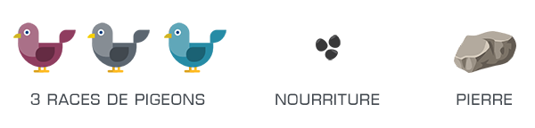

# uqac-poa-pigeonsquare

<h2>8INF957 Programmation objet avancée - Hivers 2018 - UQAC</h2>
<h3>Devoir 2</h3>

<b>David Delemotte, Rénald Morice</b>

---

<h4>Lancement</h4>

---

<h4>Commandes</h4>

**`Clic gauche`** Ajouter un pigeon (race aléatoire) 
**`Clic droit`** Ajouter des graines 
**`Clic du milieu`** Lancer une pierre 
**`Touche R`** Remettre à zéro 

---

<h4>Ce qui a été réalisé</h4>

- [x] Ajout d'un pigeon (10 max), de graines (3 max) ou d'une pierre (2 max) au clic de la souris.
- [x] Les 3 races de pigeons apparaissent aléatoirement. Chacune à une vitesse différente.

- [x] Les pigeons se déplacent vers la nourriture la plus proche. Lorsqu'il n'y a pas de nourriture ils attendent.
- [x] Si pendant son déplacement, une nourriture encore plus proche est ajouté, le pigeon change d'objectif.
- [x] Seul le premier pigeon qui arrive à la nourriture la mange. Les autres pigeons s'arrêtent alors.
- [x] La nourriture pourrie au bout d'un moment, les pigeons ne la mangent pas. Ensuite elle disparait.

- [x] Lorsque l'on lance une pierre, les pigeons autours prennent peur et s'éloignent à des positions aléatoires.
- [x] La pierre disparaît au bout de quelques secondes.
